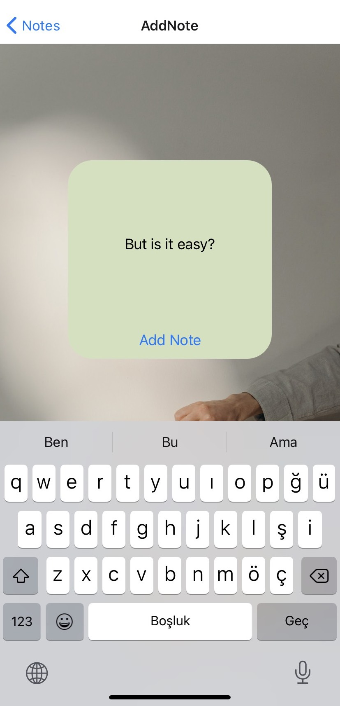
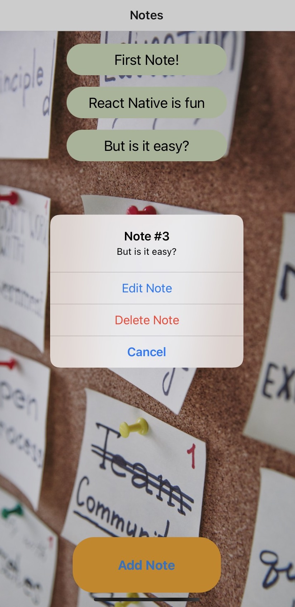
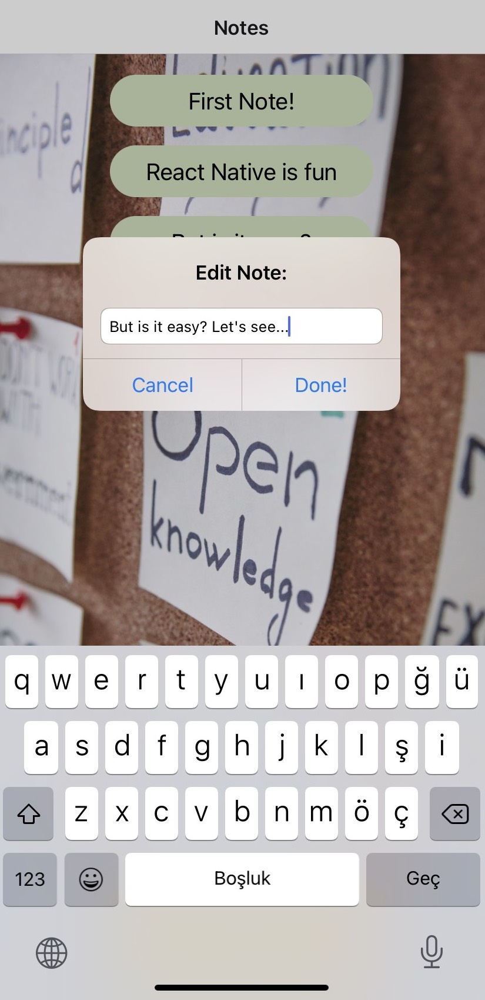

# notes-mobile
A mobile application for taking notes, written in React Native. This is a project I developed for the course 'Web and Mobile Programming'.

User can add notes, edit and delete them. The app uses Async Storage functionality so notes are staying in user's local machine.

App is published at [Expo](https://expo.dev/@tancetiner/Notes)

### Screenshots
Images are from the iOS version.

#### Notes Screen:

 

#### Add Note Screen:

 

#### Options for existing notes:

 

#### Editing notes:

